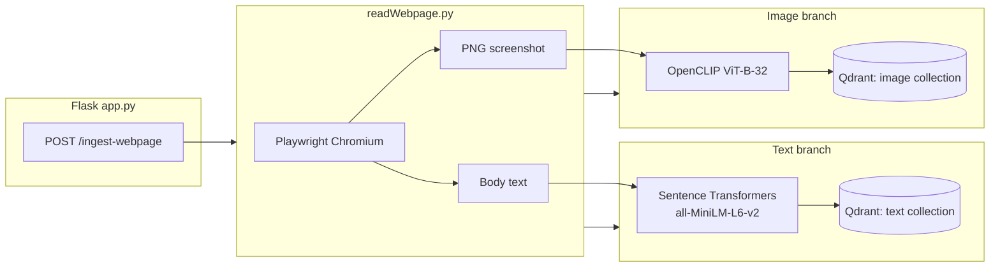

# ThimmanaThale

<!-- Quick edit: change sections below as the system grows. Diagrams use Mermaid (GitHub & many editors render them live). -->

## Environment

- Python 3.10+ (project was created with Anaconda)
- Activate: `conda activate ./env`
- Install deps: `pip install -r requirements.txt`
- **Playwright browsers** (once): `playwright install chromium`
- **Qdrant** running (default `http://localhost:6333`)
- **Ollama** optional for `/chat`: `ollama run qwen3:8b`

---

## System design

High-level flow from HTTP to vector storage.



### Responsibilities

| Piece | Role |
|--------|------|
| `app.py` | HTTP routes: streaming `/chat` (Ollama), `/ingest-webpage` (URL → vectors). |
| `readWebpage.py` | Headless browser: load URL, `body` text, full-page PNG. |
| `embeddings_service.py` | Lazy-loaded **text** encoder and **OpenCLIP** image encoder. |
| `qdrant_webpage.py` | Two Qdrant **targets** (separate URLs optional); creates collections if missing; upserts points with payload (`url`, `text` or `kind`, optional `title`). |
| `qDrant.py` | Standalone sample script (sentence search demo), not used by the ingest route. |
| `langIntegration.py` | Alternate LangGraph + Flask chat experiment. |

### Data split: two Qdrant stores

By default **both** collections live on the same Qdrant server but as **different collections** (two logical databases). Point IDs are UUIDs per ingest.

| Collection env | Default name | Vector dim | Source |
|----------------|--------------|------------|--------|
| `QDRANT_TEXT_COLLECTION` | `webpage_text` | 384 | Sentence Transformers |
| `QDRANT_IMAGE_COLLECTION` | `webpage_image` | 512 | OpenCLIP ViT-B-32 |

Optional: point **text** and **image** collections at different servers:

- `QDRANT_TEXT_URL` (default `http://localhost:6333`)
- `QDRANT_IMAGE_URL` (default `http://localhost:6333`)

---

## API examples

**Ingest a webpage**

```bash
curl -s -X POST http://127.0.0.1:5000/ingest-webpage \
  -H "Content-Type: application/json" \
  -d '{"url":"https://example.com"}'
```

**Chat (streaming)** — Postman may not show SSE well; use `curl -N`:

```bash
curl -N -X POST http://127.0.0.1:5000/chat \
  -H "Content-Type: application/json" \
  -d '{"prompt":"hello"}'
```

---

## Editing this document

- Keep **System design** in sync when you add routes, models, or Qdrant layouts.
- Adjust the Mermaid block when components move; it is plain text in the repo.
- Tables and env vars are the “contract” for operators—update when defaults change.


# 🌐 Browser Extension – Add to Workspace Feature

This branch introduces a **Chrome extension integration** that allows users to quickly add any webpage to their workspace via a right-click action.

---

## ✨ What’s Added

* A browser extension feature that adds a **“Add to Workspace”** option in the right-click menu
* Sends the **current page URL** to the backend API
* Provides instant feedback using an **alert popup**
* Designed to integrate seamlessly with the existing workspace ingestion pipeline

---

## 🔀 Branch Purpose

This branch focuses on:

* Rapid capture of web content from the browser
* Improving user workflow (no manual copy-paste of URLs)
* Laying the foundation for a future **web clipper system**

---

## ⚙️ How It Works

1. User right-clicks anywhere on a webpage
2. Selects **“Add to Workspace”**
3. Extension sends a POST request:

```
POST /ingest-webpage
```

### Payload:

```json
{
  "url": "<current_page_url>"
}
```

4. User sees:

* ✅ Success → “Page added to workspace”
* ❌ Failure → “Failed to save page”

---

## 📁 Extension Files

```
extension/
 ├── manifest.json
 ├── background.js
```

---

## 🔧 Setup (Development)

1. Navigate to:

   ```
   chrome://extensions
   ```
2. Enable **Developer mode**
3. Click **Load unpacked**
4. Select the `extension/` folder from this branch

---

## 🔐 Permissions Used

```json
"permissions": ["contextMenus", "scripting"],
"host_permissions": [
  "<all_urls>",
  "http://127.0.0.1:5000/*"
]
```

* `contextMenus` → adds right-click action
* `scripting` → injects alert for feedback
* `host_permissions` → allows API calls + script execution

---

## ⚠️ Limitations

* Does not work on restricted pages:

  * `chrome://`
  * browser settings pages
* Uses alert-based feedback (temporary UX)
* Requires backend service to be running locally

---

## 🧪 Testing

* Open any webpage (e.g. https://google.com)
* Right-click → **Add to Workspace**
* Verify:

  * Alert appears
  * Backend receives URL

---

## 🔮 Future Scope

* Replace alert with **toast UI**
* Add metadata capture (title, description)
* Support selection-based capture
* Add authentication support
* Convert into full **Notion-style web clipper**

---

## 🧠 Notes

This implementation prioritizes:

* Simplicity
* Reliability
* Minimal permissions

It serves as a base layer for more advanced browser-based ingestion features.

---

## ✅ Summary

This branch enables **one-click webpage ingestion** directly from the browser, significantly improving usability and paving the way for richer capture capabilities.
